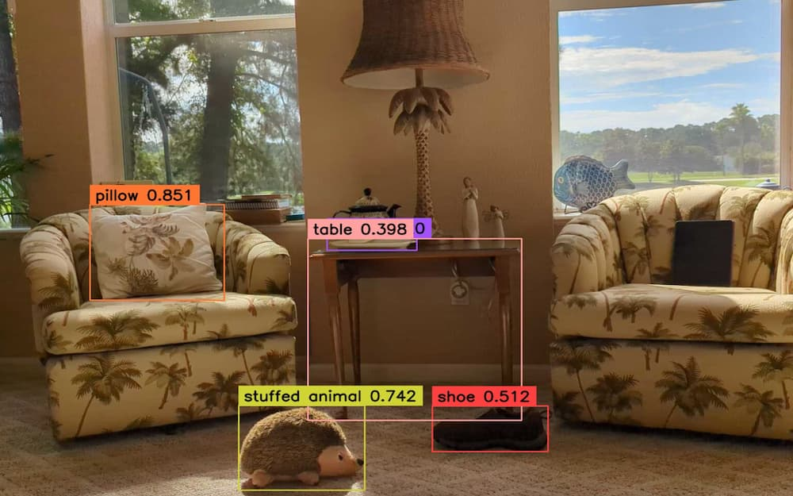

# YOLO-World IP Cam: Real-time Object Detection on Your Smartphone



**Turn your smartphone into a smart IP camera with real-time object detection powered by YOLO-World!**

This Flask application utilizes the YOLO-World model to detect objects in live video streams from any IP camera, including your phone running the [IP Webcam app](https://play.google.com/store/apps/details?id=com.pas.webcam&pcampaignid=web_share). 

**Here's the magic:**

1. **Your Phone as the Camera:** The IP Webcam app transforms your phone into a wireless IP camera, streaming live video to the application.
2. **YOLO-World in Action:** The YOLO-World model, customized for your needs, detects objects in the video stream in real-time.
3. **Live Object Tracking:** The application analyzes the video frame-by-frame, drawing bounding boxes around objects and tracking them throughout the video.

**Benefits of YOLO-World IP Cam:**

* **Rapid Prototyping:** Quickly get your object detection model up and running with YOLO-World, allowing you to focus on refinement.
* **Continuous Learning:** Capture screenshots of specific objects for ongoing model training, improving its accuracy over time.

## Unleashing the Power of YOLO-World

YOLO-World stands out for its unique "prompt-then-detect" approach. Unlike traditional models limited to predefined categories, YOLO-World detects objects based on descriptive text prompts. This opens up a world of possibilities:

* **Prompt the Model:** Describe the object you want to detect using any text, not just predefined categories.
* **Real-time Detection:** The model leverages your prompt to find the described object in the video stream.

This innovative approach makes YOLO-World a powerful tool for various real-world applications requiring open-vocabulary object detection.

## Table of Contents

- [Installation](#installation)
- [Configuration](#configuration)
  - [Control Detection Accuracy with Confidence Threshold](#control-detection-accuracy-with-confidence-threshold)
  - [Eliminate Double Detections with Non-Max Suppression (NMS)](#eliminate-double-detections-with-non-max-suppression-nms)
- [Running the Application](#running-the-application)
- [Code Overview](#code-overview)
  - [app.py](#apppy)
  - [config.py](#configpy)
  - [models/yolo_world.py](#modelsyolo_worldpy)
  - [video_processing/annotators.py](#video_processingannotatorspy)
  - [video_processing/stream.py](#video_processingstreampy)
  - [templates/index.html](#templatesindexhtml)
- [License](#license)
- [Acknowledgments](#acknowledgments)
- [Contact](#contact)

## Installation

1. **Clone the repository:**

    ```bash
    git clone https://github.com/cloud-ray/yolo-world-detection.git
    cd yolo-world-detection
    ```

2. **Create and activate a virtual environment:**

    ```bash
    python3 -m venv venv
    source venv/bin/activate
    ```

3. **Install the required dependencies:**

    ```bash
    pip install -r requirements.txt
    ```

## Configuration

Modify the `config.py` file to set up your video source and model parameters.

### Control Detection Accuracy with Confidence Threshold

Set the CONFIDENCE_THRESHOLD to determine the minimum confidence score required for a detection to be considered valid. By adjusting this value, you can balance the trade-off between detecting more objects and ensuring the accuracy of those detections. For example:
- Set a lower confidence threshold (e.g., 0.01) to detect more objects, but be prepared for a higher risk of false positives.
- Set a higher confidence threshold (e.g., 0.5) to detect fewer, but more accurate objects.

### Eliminate Double Detections with Non-Max Suppression (NMS)

Use the NMS_THRESHOLD to control the similarity threshold for duplicate detections. NMS evaluates the overlap between detections using the Intersection over Union metric. If the overlap exceeds the defined threshold, NMS discards the duplicates with the lowest confidence. Set the NMS_THRESHOLD value between 0 and 1, where:
- Smaller values (e.g., 0.01) are more restrictive, merging very similar detections and reducing the number of detected objects.
- Larger values (e.g., 0.5) are less restrictive, merging less similar detections and resulting in more objects being detected.

## Running the Application

1. **Start the Flask app:**

    ```bash
    python app.py
    ```

2. **Access the application:**

    Open your web browser and navigate to `http://0.0.0.0:5025`.

## Code Overview

### app.py

The main Flask application that sets up the routes and starts the server.

### config.py

Contains configuration variables for the video source and model parameters.

### models/yolo_world.py

Defines the `YOLOModel` class that wraps the YOLO model for object detection.

### video_processing/annotators.py

Contains functions to annotate frames with bounding boxes and labels.

### video_processing/stream.py

Defines the `VideoStream` class that handles reading frames from the video source and applying the YOLO model for detection.

### templates/index.html

The HTML template for the web interface.

## License

This project is licensed under the MIT License - see the [LICENSE](LICENSE) file for details.

## Acknowledgments

- [Zero-shot object detection with YOLO World](https://supervision.roboflow.com/develop/notebooks/zero-shot-object-detection-with-yolo-world/)
- [YOLOv10: How to Train](https://blog.roboflow.com/yolov10-how-to-train)
- [YOLO World documentation](https://docs.ultralytics.com/models/yolo-world/)

## Contact
For any questions or comments, please contact [Ray](mailto:ray@cybersavvy.one).