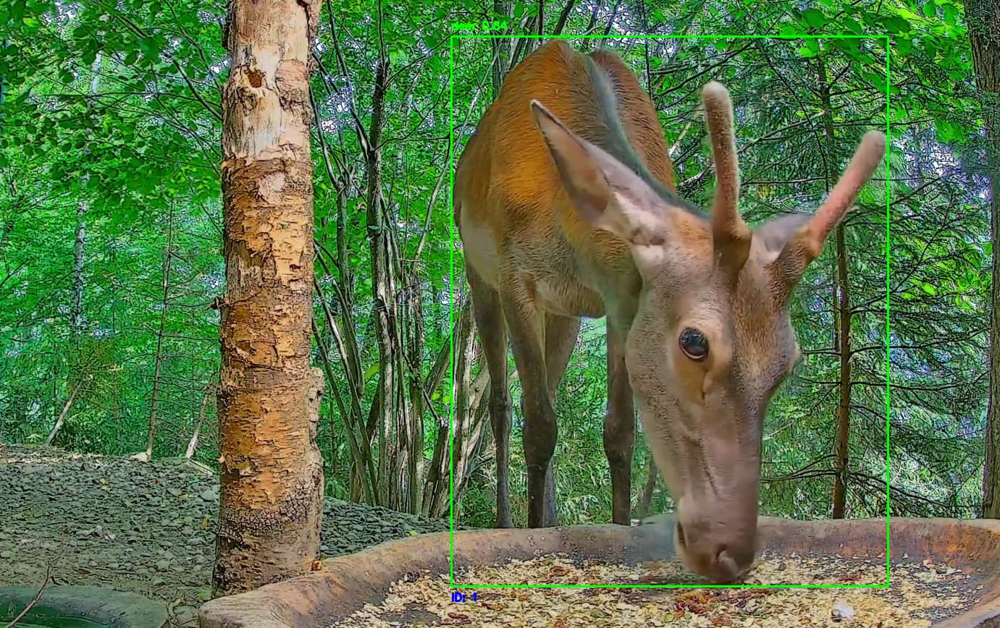

# YOLO-World Data Engine: Build Custom Vision Datasets, Hands-Free


Welcome to the **YOLO-World Data Engine**, a powerful tool designed to simplify the creation of high-quality datasets for custom object detection tasks. 

This project leverages the YOLO-World framework to automatically collect, label, and prepare image data from live video streams, enabling you to train tailored computer vision models without the need for manual data collection.

## Why YOLO-World Data Engine?

In the world of computer vision, data is key. While pre-trained models provide a starting point, they often fall short in specific environments or tasks due to their generic training data. The YOLO-World Data Engine addresses this by:

- **Custom Class Detection:** Define your own object classes and capture data from live streams tailored to your needs.
- **Automated Data Collection:** Capture and store images when objects are detected above a confidence threshold, ensuring high-quality data.
- **Efficient Data Processing:** Automatically resize images and convert bounding box annotations to the YOLO format, ready for training.
- **Scalable Storage Solutions:** Organize your dataset with an SQLite database, making it easy to query and manage your data.

## Benefits

- **Cost-Effective:** Reduce costs associated with manual labeling and pre-trained model usage.
- **Scalable:** Continuously collect data from multiple video feeds to build comprehensive datasets.
- **Customizable:** Train models specifically tailored to your unique needs and environments.

The YOLO-World Data Engine empowers researchers, developers, and AI enthusiasts to unlock the potential of custom object detection with ease. Dive in, explore its features, and start building your own datasets today!

## Table of Contents

- [Installation](#installation)
- [Usage](#usage)
- [Project Structure](#project-structure)
- [Configuration](#configuration)
- [Learn More](#learn-more)
- [Contributing](#contributing)
- [License](#license)

## Installation

To set up the project, ensure you have Python installed along with the required packages:

1. **Clone the repository:**

   ```bash
   git clone https://github.com/cloud-ray/yolo-world-detection.git
   cd yolo-world-detection
   ```

2. **Checkout the feature/youtube-live branch:**

   ```bash
   git checkout feature/youtube-live
   ```

3. **Create and activate a virtual environment::**

   ```bash
   python3 -m venv venv
   source venv/bin/activate
   ```

4. **Install dependencies:**

   ```bash
   pip install -r requirements.txt
   ```

5. **Set up the SQLite database:**

   ```bash
   python setup/initialize_database.py
   ```

## Usage

To run the object detection application, execute the `main.py` file:

```bash
python main.py
```

This will start the video stream processing, displaying detected objects in real-time.

## Project Structure

- **`main.py`**: The entry point for the application, managing initialization and processing of video streams.
  
- **`yolo_model.py`**: Handles the initialization of the YOLO model.

- **`stream_handler.py`**: Manages video stream initialization using the CamGear library.

- **`functions/`**:
  - **`frame_processor.py`**: Processes video frames for object detection and tracking, applying models to track objects.
  - **`labeler.py`**: Manages YOLO label creation and updates, converting bounding box formats and updating databases.
  - **`object_tracker.py`**: Maintains a global dictionary to track detected objects, recording confidence scores and frame counts.
  - **`screenshot_handler.py`**: Captures and saves screenshots of detected objects based on conditions.
  - **`screenshot_resizer.py`**: Resizes screenshots and updates the database with new image details.

- **`utils/`**:
  - **`config.py`**: Defines configuration settings for detection thresholds, image processing, and paths.
  - **`frame_utils.py`**: Provides utilities for frame rate management and FPS calculation.
  - **`logger.py`**: Sets up logging configuration for the project, outputting detailed logs.

## Configuration

The `utils/config.py` file contains all configurable settings for the project, such as:

- Model paths and classes.
- Video source URLs.
- Detection thresholds and image processing parameters.
- Database and directory paths for screenshots and logs.

Edit these configurations as needed to match your environment and requirements.

## Learn More

For a detailed overview of the YOLO-World Data Engine project, check out my [blog post](https://cloudray.medium.com/yolo-world-data-engine-build-custom-vision-datasets-hands-free-f95bcab90099) where I discuss the motivation, features, and potential applications of this project.

## Contributing

Contributions are welcome! Please feel free to submit issues or pull requests to improve the project.

## License

This project is licensed under the MIT License - see the [LICENSE](LICENSE) file for details.

## Acknowledgments

- [YOLO-World Model](https://docs.ultralytics.com/models/yolo-world)
- [How to Detect Objects with YOLO-World](https://blog.roboflow.com/how-to-detect-objects-with-yolo-world/)
- [Object Counting using Ultralytics YOLOv8](https://docs.ultralytics.com/guides/object-counting/)
- [PixCams.com Wildlife Cam 2 Live Stream](https://www.youtube.com/live/F1Q7iN_RWUs?si=i7zjD5sDlsMy-sef)
- [Live Birds In 4K! Cornell Lab FeederWatch Cam at Sapsucker Woods](https://www.youtube.com/live/x10vL6_47Dw?si=rTB1bcfrsP9aELE2)
- [🔴 Ohio Backyard Wildlife: Live Cam Of Birds, Rabbits, And Squirrels!](https://www.youtube.com/live/OIqUka8BOS8?si=56OndqNXGyWHC0kT)


## Contact

For any questions or comments, please contact [Ray](mailto:ray@cybersavvy.one).
